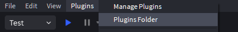
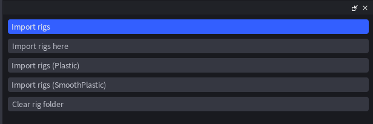

# Riggi Plugin

Roblox plugin for inserting characters. Currently only works with Perdere character saves.

## Installation

### Github Releases
You can install the latest `.rbxm` of the plugin [here](https://github.com/raineyraine/riggi_plugin/releases/latest). Then, you will have to add it as a local plugin in studio. Use `Plugins > Plugins Folder` to find that folder:

You will likely have to reload studio to have it properly install.

### Build Manually

You can also clone the repository and run the `lune build -i` script to build and install the plugin.

## Usage

The main interface looks like this:

* **Import rigs**\
  Prompts the user to upload `*.json` or `*.txt` files. The loaded rigs are placed in a folder in Workspace. It's recommended to not touch rigs in this folder, and to instead copy and paste rigs from the folder when needed.
* **Import rigs here**\
  Same as **Import Rigs**, but at the camera.
* **Import rigs (Plastic)**\
  Same as **Import Rigs**, but all accessory materials are Plastic.
* **Import rigs (SmoothPlastic)**\
  Same as **Import Rigs**, but all accessory materials are SmoothPlastic.
* **Clear rig folder**\
  Clears the children of the Workspace folder.
